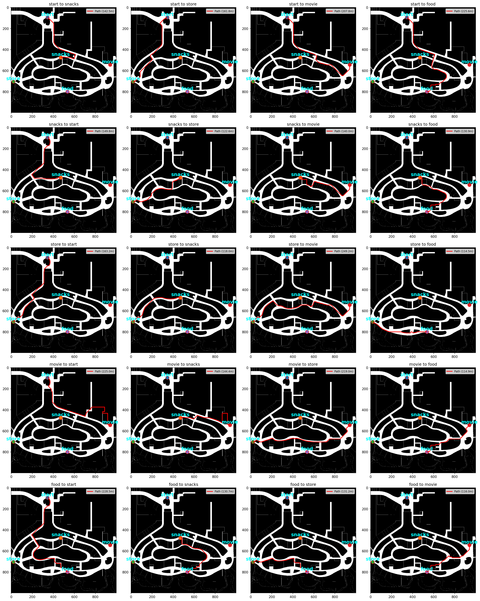
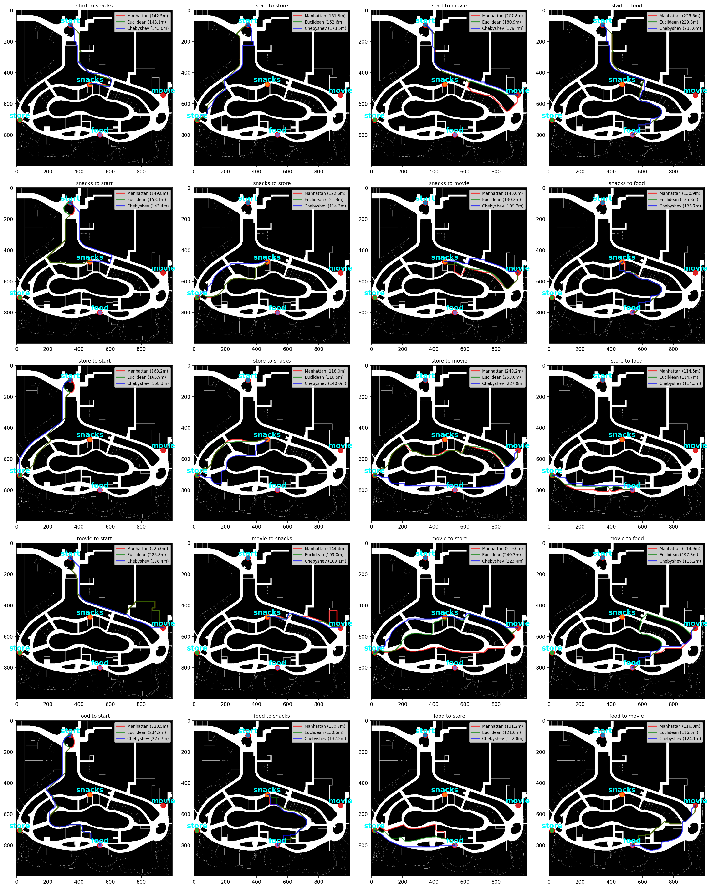
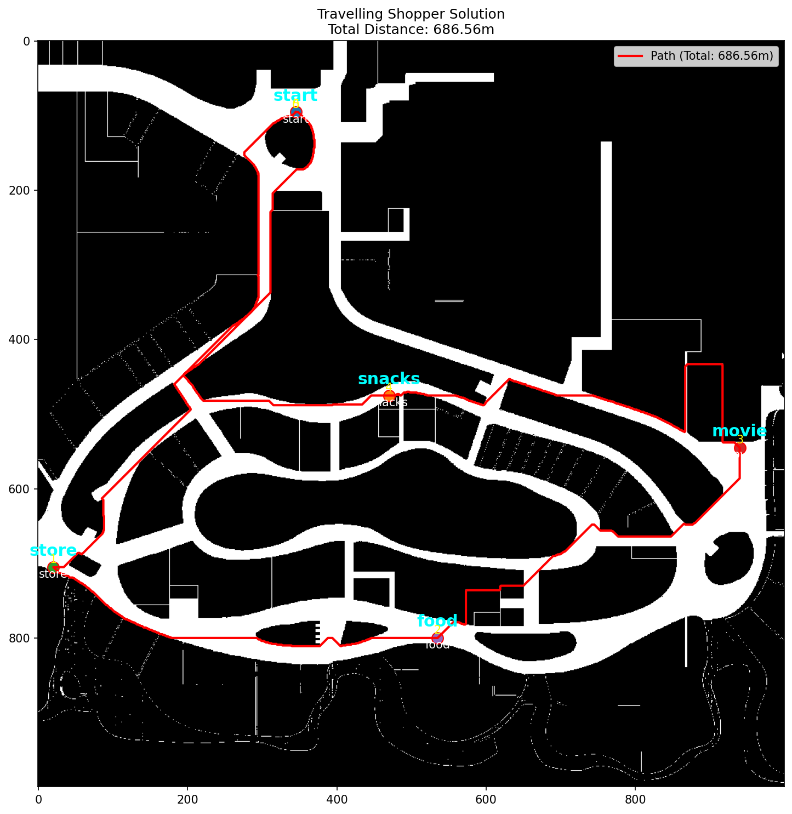
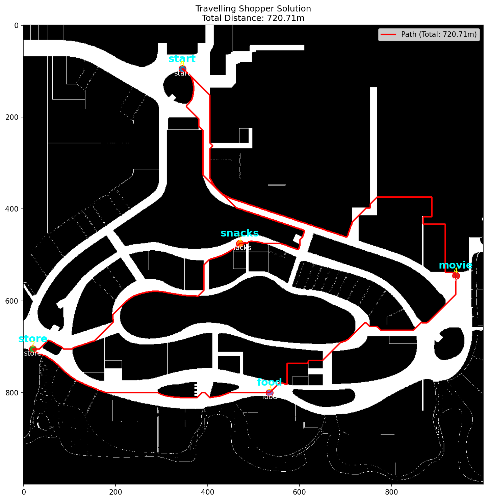

# ME5413_HW3
## 📌 Overview
This project implements the *A** Algorithm & TSP Solver for path planning on a given grid-based map.  

## 🛠 Dependencies
```bash
pip install -r requirements.txt
```

## Task1 Global Planning

### 1.1 Basic A*

### 1.2 A* with different heuristic function



## Task 2 (Bonus): The “Travelling Shopper” Problem
### 2.1 Brute Force tsp

### 2.2 Nearest Neighbor tsp

